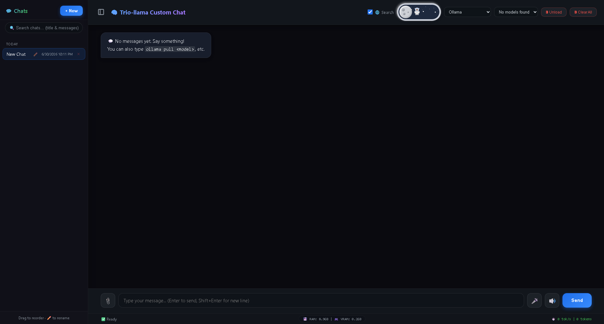

# 🧠 Ollama Custom Chat – with a Fallback Twist

[](https://opensource.org/licenses/MIT)
[](https://www.python.org/)
[](https://github.com/meowmeowsmh/ollama-chat-interface)

> A full‑featured, multi‑conversation chat interface for [Ollama](https://ollama.com) – **100% free**, no API keys, no limits (when using Ollama).  
> Plus, a **clever fallback** that shows a fun 404 page with background music when the backend is down – so you never see a boring “connection refused” again.

Everything auto‑creates itself – just clone, run, and go.

---

## ✨ Features

| Feature | Description |
|---------|-------------|
| 🔓 **100% FREE** | No API keys, no rate limits, no bills – if you stick to **Ollama**. |
| 🧠 **Any Model** | Works with Qwen, Llama, Mistral, DeepSeek, and more. |
| 🌐 **Web Search** | Optional DuckDuckGo search for up‑to‑date answers. |
| 🎤 **Voice Input** | Speech‑to‑text directly in your browser. |
| 📎 **File/Image Upload** | Attach images, PDFs, text files, code files. |
| 💾 **Live Monitor** | Shows RAM & VRAM usage in real time. |
| 🔒 **HTTPS** | Auto‑generates certificates on Windows – just run and go. |
| 🚦 **Smart Fallback** | A built‑in reverse proxy (`fallback.py`) serves a custom `404.html` with a GIF and background music whenever Flask is down. |
| 🎵 **“Troll” 404 Page** | The error page autoplays `Meatball-Parade(chosic.com).mp3` and shows a funny animation – great for pranks or just making downtime more entertaining. |
| 📦 **One‑Click Launcher** | `start.py` launches both the fallback proxy and Flask in separate windows (or tabs), so you never get “connection refused”. |

---

## 🚀 Quick Start

---
## How to clone from my github
git clone https://github.com/meowmeowsmh/ollama-chat-interface.git
cd ollama-chat-interface
---
## How to install the package:
 pip install -r requirements.txt
 if you still see import errors then used pip install <import>
---
# how to launch I have changed the direction 
python start.py
Why? 
it will run seperately
Terminal 1 (Proxy): python fallback.py
Terminal 2 (Flask): python app.py
---
### 1️⃣ Install Ollama
Download and install Ollama from [ollama.com](https://ollama.com).  
Then pull a model of your choice:
```bash
ollama pull vaultbox/qwen3.5-uncensored:9b

